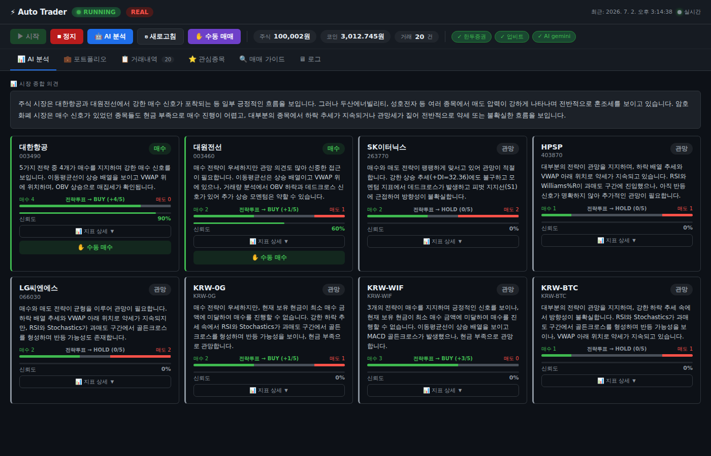
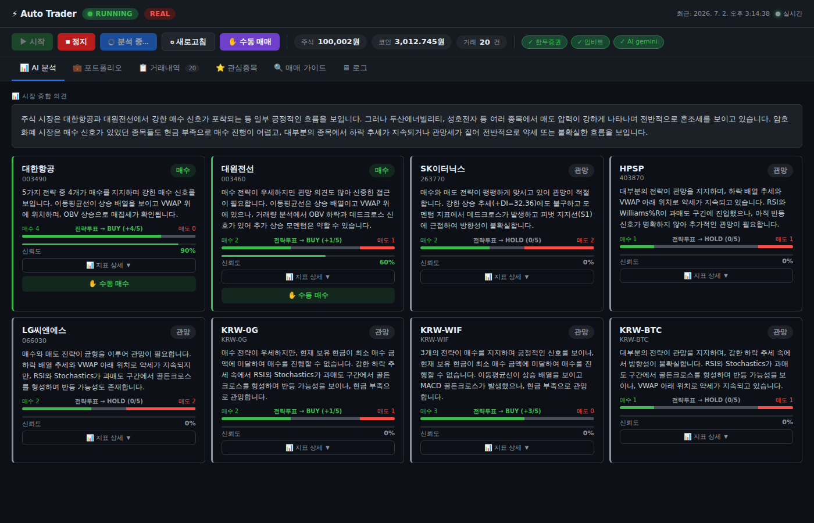
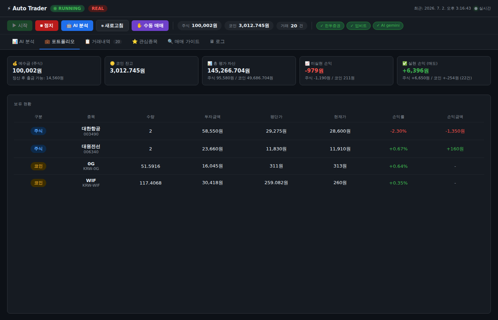
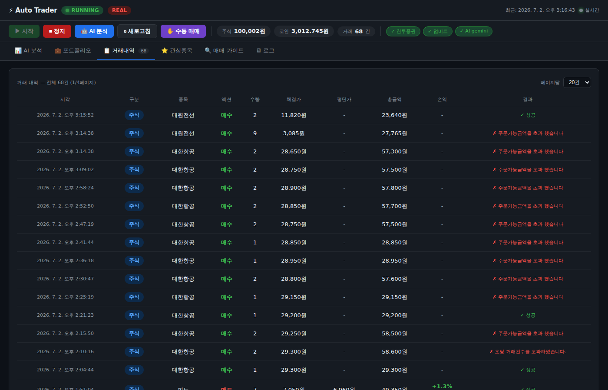
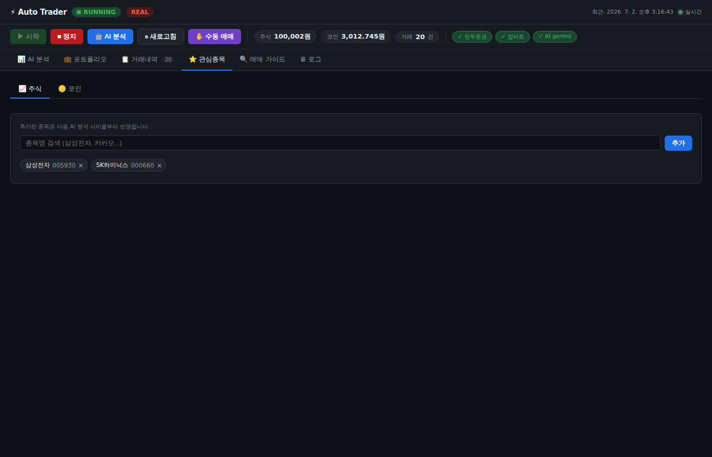
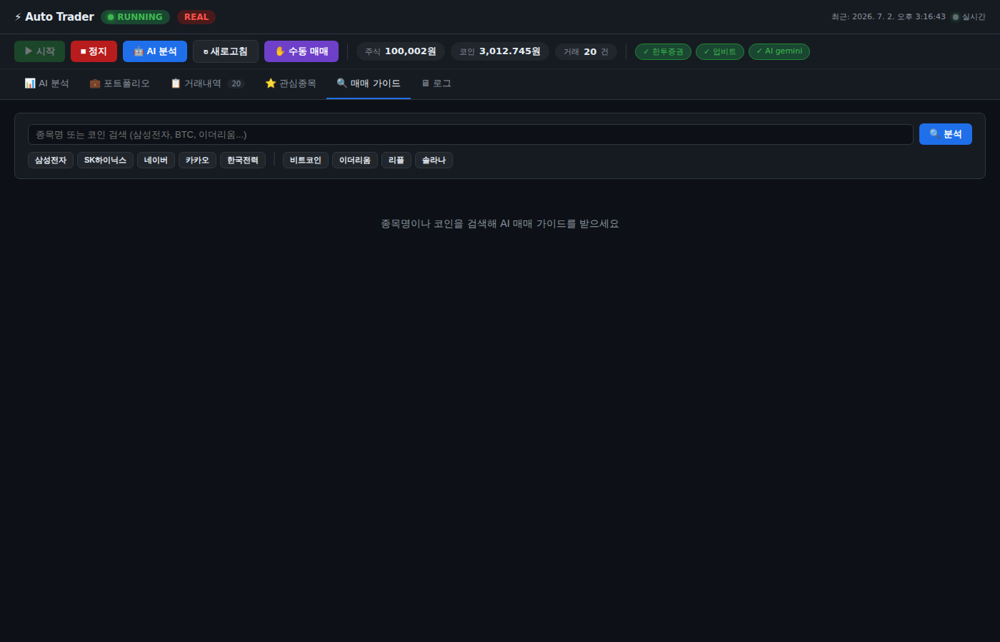

# Auto Trader - AI 자동매매 시스템

> 한국투자증권(주식) + 업비트(코인) AI 자동매매 대시보드  
> 5가지 기술적 전략 코드 투표 → AI 신뢰도 산출 → 자동 주문 실행

---

## 화면 미리보기

### 메인 대시보드


### AI 분석 (5전략 코드 투표 시스템)


### 포트폴리오 현황


### 거래내역


### 관심종목


### 매매 가이드


---

## 주요 기능

| 기능 | 설명 |
|------|------|
| 5전략 코드 투표 | 추세추종·모멘텀·평균회귀·돌파·거래량 각 +1/0/-1 투표 → 방향 결정 |
| AI 신뢰도 산출 | Gemini / Claude / Ollama 중 선택, 투표 결과 기반 신뢰도 부여 |
| 수동 매매 | 종목명 검색 → 비율(10%~전체) 선택 → 즉시 주문 |
| 실시간 스트리밍 | SSE로 봇 로그·결정 실시간 표시 |
| GitHub Webhook 자동배포 | 푸시 → GCP 자동 git pull + 서비스 재시작 |

## 기술 스택

```
Backend   FastAPI + SSE (실시간 스트리밍)
AI        Google Gemini / Anthropic Claude / Ollama (선택)
주식 API  한국투자증권 KIS API
코인 API  업비트 Open API
인프라    GCP Compute Engine (Ubuntu 24.04)
배포      GitHub Webhook → 자동배포 스크립트
```

## 5전략 투표 시스템

```
추세추종   ADX + 이동평균 골든/데드크로스     → +1 / 0 / -1
모멘텀     RSI · Stochastic · Williams%R · ROC → +1 / 0 / -1
평균회귀   MACD · 볼린저밴드 · VWAP           → +1 / 0 / -1
돌파전략   52주 신고가 · Pivot R1/S1          → +1 / 0 / -1
거래량분석 OBV · 거래량 비율                  → +1 / 0 / -1

합산 score > 0 → BUY / score < 0 → SELL / score = 0 → HOLD
AI는 방향을 바꿀 수 없고, 신뢰도와 이유만 부여
```

---

한국투자증권(주식) + 업비트(코인) AI 자동매매. AI 엔진은 **Gemini(기본)** 또는
Ollama(로컬·무료), Claude(Anthropic)로 전환할 수 있습니다.

## 빠른 시작

### 1. 설치
```bash
cd auto-trader
pip install -r requirements.txt
```

### 2. API 키 설정
```bash
cp .env.example .env
# .env 파일을 열어 API 키 입력
```

#### API 키 발급 방법
| 서비스 | 발급 경로 |
|--------|-----------|
| 한국투자증권 | https://apiportal.koreainvestment.com → 앱 신청 |
| 업비트 | 마이페이지 → Open API 관리 |
| AI 엔진 | 기본은 Ollama(로컬·키 불필요). Claude 쓰려면 https://console.anthropic.com → API Keys |

#### AI 엔진 (기본: Ollama, 무료)
```bash
# 1) Ollama 설치: https://ollama.com
# 2) 모델 내려받기 (한 번만)
ollama pull qwen2.5
# 3) .env 에서 AI_PROVIDER=ollama (기본값) 확인 → 끝. API 키/결제 불필요
```
Claude로 바꾸려면 `.env`에 `AI_PROVIDER=anthropic` + `ANTHROPIC_API_KEY` 설정.

### 3. 실행

```bash
# 대화형 CLI (메뉴 방식)
python main.py

# 웹 대시보드 (http://localhost:8000)
python main.py web

# 봇 자동 시작 (백그라운드)
python main.py start

# 1회 분석만 실행
python main.py once
```

## 시스템 구조

```
사용자
  ├── 콘솔 CLI (main.py)
  └── 웹 대시보드 (localhost:8000)

AI 엔진 (Ollama 로컬 / Claude 선택)
  ├── 종목/코인 1차 스크리닝
  ├── 기술적 지표 분석 (RSI, MACD, 볼린저밴드, MA, Stochastic)
  └── 매수/매도/홀드 결정 + 신뢰도 산출

실행
  ├── 한국투자증권 KIS API (주식)
  └── 업비트 API (코인)

리스크 관리
  ├── 손절: -5% 자동 매도
  ├── 익절: +15% 자동 매도
  ├── 종목당 최대 비중: 10%
  └── 신뢰도 70% 미만 → 스킵
```

## 주요 설정 (.env)

| 항목 | 기본값 | 설명 |
|------|--------|------|
| KIS_MOCK | true | true=모의투자, false=실전 |
| TRADE_INTERVAL_MINUTES | 30 | AI 분석 주기 |
| MAX_POSITION_RATIO | 0.1 | 종목당 최대 비중 (10%) |
| STOP_LOSS_RATIO | 0.05 | 손절 기준 (-5%) |
| TAKE_PROFIT_RATIO | 0.15 | 익절 기준 (+15%) |

## 주의사항

- **반드시 모의투자(KIS_MOCK=true)로 먼저 테스트하세요**
- 자동매매는 손실 위험이 있습니다
- API 키는 절대 공유하지 마세요
